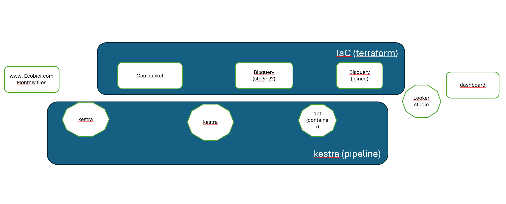

# 🚴 Ecobici Data Pipeline

This project showcases the development of a complete batch data pipeline using open data from Ecobici CDMX. The main goal is to demonstrate end-to-end capabilities in orchestration, ingestion, modeling, and data visualization in the cloud, rather than performing deep analytical insights on the dataset itself.
<p align="center">
  
</p>

<p align="center">
  
  
  
</p>


---
# 🧭 About Ecobici
Ecobici is Mexico City's public bike-sharing system, designed to provide a sustainable and accessible mobility alternative for urban residents. Since its launch in 2010, Ecobici has become one of the largest bike-sharing systems in Latin America, with hundreds of stations, thousands of bicycles, and millions of trips logged.

To promote transparency and enable data-driven urban planning, Ecobici publishes monthly open datasets, which include detailed records of each trip: timestamps, origin and destination stations, user type, and duration.

> This dataset is particularly suited for data engineering projects due to:
> - Its **recurring and structured format**, ideal for batch pipelines.
> - Real-world complexity (e.g., missing data, varying formats).
> - Public accessibility without the need for synthetic data.
> - Its size, which is large enough to be meaningful, but manageable for cloud tools like BigQuery.

---

## 🌐 Architecture Overview



---

## ☁️ Cloud Infrastructure

The pipeline leverages **Google Cloud Platform (GCP)** services:

- 📁 GCS (Google Cloud Storage): acts as the Data Lake
- 🧮 BigQuery: for data ingestion and transformation
- 📊 Looker Studio: for final data visualization
- ⚙️ **Terraform**: used to provision all cloud infrastructure components

> ⚠️ **Note:** In a real-world production setting, Kestra would typically run in the cloud (via Kubernetes or a VM).  
> In this project, **Kestra is executed locally** to orchestrate the pipeline while minimizing cloud costs.  
> All data infrastructure lives in the cloud and is fully managed via Terraform for scalability and reproducibility.

---

## 🧩 Pipeline Components

| Stage                 | Tool              | Description                                                                   |
|----------------------|-------------------|-------------------------------------------------------------------------------|
| Orchestration         | Kestra            | Locally running orchestrator triggering each batch pipeline step             |
| Data Lake             | Google Cloud Storage | Stores raw monthly files from Ecobici                                        |
| Ingestion to DWH      | BigQuery          | Loads GCS files into intermediate staging tables                             |
| Transformations       | dbt               | Transforms staging tables into joined models, containerized and orchestrated |
| Visualization         | Looker Studio     | Dashboard with at least 2 visual insights                                     |

---

## Project Structure

``` bash
ecobici-data-pipeline/
├── terraform/           # Infrastructure as Code for GCP resources
├── kestra/              # Kestra workflow definitions
├── dbt/                 # dbt models and project files
├── dashboard/           # Dashboard screenshots or link
├── img/                 # Diagrams, banners, visuals
├── README.md
└── ...
```
---


## 📊 Dashboard

🔗 View in Looker Studio

---

## 🛠️ How to Run

```bash
# 1. Initialize and apply Terraform
cd terraform/
terraform init
terraform apply

# 2. Run the pipeline with Kestra CLI
cd kestra/
kestra start

# 3. Explore the data in BigQuery
# 4. Open the dashboard in Looker Studio
```

## 🐳 Optional: Run in Docker

To facilitate reproducibility, you can optionally run the pipeline inside a pre-configured container:

``` bash
Copiar
Editar
cd docker/
docker build -t ecobici-pipeline .
docker run --rm -v $(pwd):/app ecobici-pipeline
```
This image includes Terraform, dbt and Kestra CLI, allowing full pipeline execution from a single container.

---

# 🧱 Unexpected Challenges
During development, a few non-trivial issues surfaced that required extra attention:

⚙️ Terraform + GCP permissions: Setting up service accounts and giving the right permissions to interact with BigQuery and GCS took some trial and error.

🧪 Testing Kestra workflows locally: Debugging Kestra without a cloud-based deployment required extra care in logging and validation.

📁 Handling historical data variations: Older Ecobici files had slight structural differences that required normalization steps before ingestion.

🧼 Cleaning inconsistencies in CSVs, including missing values and timestamp anomalies, especially in early datasets.

---

# 🛣️ Roadmap & Potential Improvements
While the current version of the pipeline meets the project requirements and showcases key data engineering capabilities, several improvements could be explored in future iterations:

🔁 Add streaming ingestion using tools like Pub/Sub or Kafka.

📦 Containerize the entire solution and deploy to Kubernetes or Cloud Run.

🔐 Implement service account roles and fine-grained IAM policies via Terraform.

📅 Automate scheduling (e.g., monthly trigger via Cloud Scheduler or Kestra's native scheduling).

📈 Enhance dashboard with richer visualizations and user segmentation.

🧪 Add data quality checks using tools like Great Expectations or dbt tests.

---

## 📚 References
DataTalksClub – Data Engineering Zoomcamp

Ecobici Open Data

---

## 👤 Author
Your Name
GitHub • LinkedIn