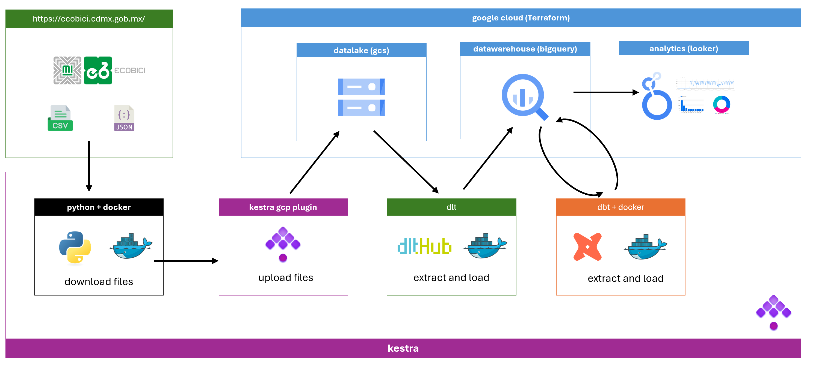

# 🚴 Mexico City's Ecobici Data Pipeline

This project showcases the development of a complete batch data pipeline using open data from Ecobici CDMX. The main goal is to demonstrate end-to-end capabilities in orchestration, ingestion, modeling, and data visualization in the cloud, rather than performing deep analytical insights on the dataset itself.
<p align="center">
  
</p>

<p align="center">
  
  
  
  
  
  
  
  
  
  
  
  
</p>


---
# 🧭 About Ecobici
Ecobici is Mexico City's public bike-sharing system, designed to provide a sustainable and accessible mobility alternative for urban residents. Since its launch in 2010, Ecobici has become one of the largest bike-sharing systems in Latin America, with hundreds of stations, thousands of bicycles, and millions of trips logged.

To promote transparency and enable data-driven urban planning, Ecobici publishes monthly open datasets, which include detailed records of each trip: timestamps, origin and destination stations, user type, and duration.

> This dataset is particularly suited for data engineering projects due to:
> - Its **recurring and structured format**, ideal for batch pipelines.
> - Real-world complexity (e.g., missing data, varying formats).
> - Public accessibility without the need for synthetic data.
> - Its size, which is large enough to be meaningful, but manageable for cloud tools like BigQuery.

---

## 🌐 Architecture Overview



---

## ☁️ Cloud Infrastructure

The pipeline leverages **Google Cloud Platform (GCP)** services:

- 📁 GCS (Google Cloud Storage): acts as the Data Lake
- 🧮 BigQuery: for data ingestion and transformation
- 📊 Looker Studio: for final data visualization
- ⚙️ **Terraform**: used to provision all cloud infrastructure components

> ⚠️ **Note:** In a real-world production setting, Kestra would typically run in the cloud (via Kubernetes or a VM).  
> In this project, **Kestra is executed locally** to orchestrate the pipeline while minimizing cloud costs.  
> All data infrastructure lives in the cloud and is fully managed via Terraform for scalability and reproducibility.

---

## 🧩 Pipeline Components

| Stage                 | Tool                    | Description                                                                 |
|----------------------|-------------------------|-----------------------------------------------------------------------------|
| Orchestration         | Kestra                  | Locally running orchestrator triggering each step in the batch pipeline    |
| Data Extraction       | Python + Docker         | Scrapes and downloads historical CSV/JSON files from Ecobici website       |
| Data Lake             | Google Cloud Storage    | Stores raw monthly files from Ecobici in GCS buckets                       |
| Ingestion to DWH      | dlt + BigQuery          | Extracts data from GCS and loads it into BigQuery staging tables           |
| Transformations       | dbt + Docker            | Transforms staging tables into cleaned and joined models                   |
| Visualization         | Looker Studio           | Dashboard with at least 2 visual insights on bike usage                    |

---

## 📁 Project Structure

``` bash
ecobici-data-pipeline/
├── dbt/                              # dbt project (models, profiles, etc.)
├── images/                           # Diagrams and visual assets
├── kestra/                           # Kestra orchestration config and flows
├── src/                              # Source scripts for data extraction
├── terraform/                        # Terraform configuration files
├── LICENSE                           # License file
└── README.md                         # Project documentation
```

---


## 📊 Dashboard

🔗 View in Looker Studio

- https://lookerstudio.google.com/s/gFyZHSl4BD8

---

## 🛠️ How to Run

```bash
# 1. Initialize and apply Terraform
cd terraform/
terraform init
terraform apply

# 2. Run the pipeline with Kestra CLI
cd kestra/
kestra start

# 3. Explore the data in BigQuery
# 4. Open the dashboard in Looker Studio
```

## 🐳 Optional: Run in Docker

To facilitate reproducibility, you can optionally run the pipeline inside a pre-configured container:

``` bash
Copiar
Editar
cd docker/
docker build -t ecobici-pipeline .
docker run --rm -v $(pwd):/app ecobici-pipeline
```
This image includes Terraform, dbt and Kestra CLI, allowing full pipeline execution from a single container.

---

## 📚 References
DataTalksClub – Data Engineering Zoomcamp

Ecobici Open Data

---

## 👤 Author
José Luis Martínez Olvera
GitHub • [GitHub](https://github.com/Maxkaizo)
LinkedIn • [LinkedIn](www.linkedin.com/in/jlmartinezol)