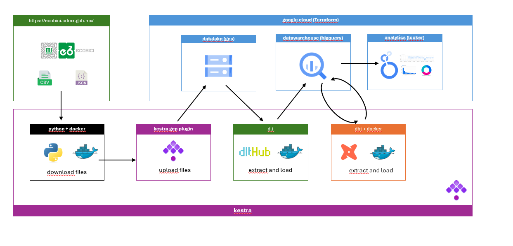
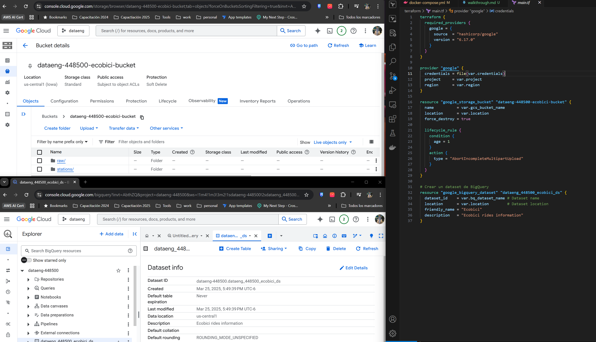
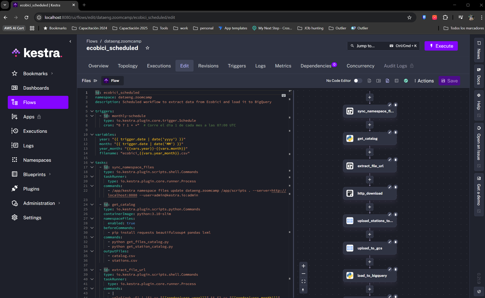
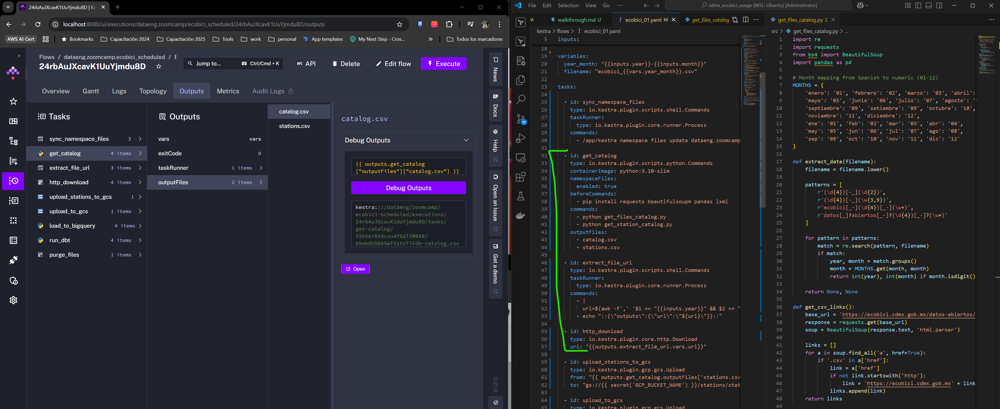
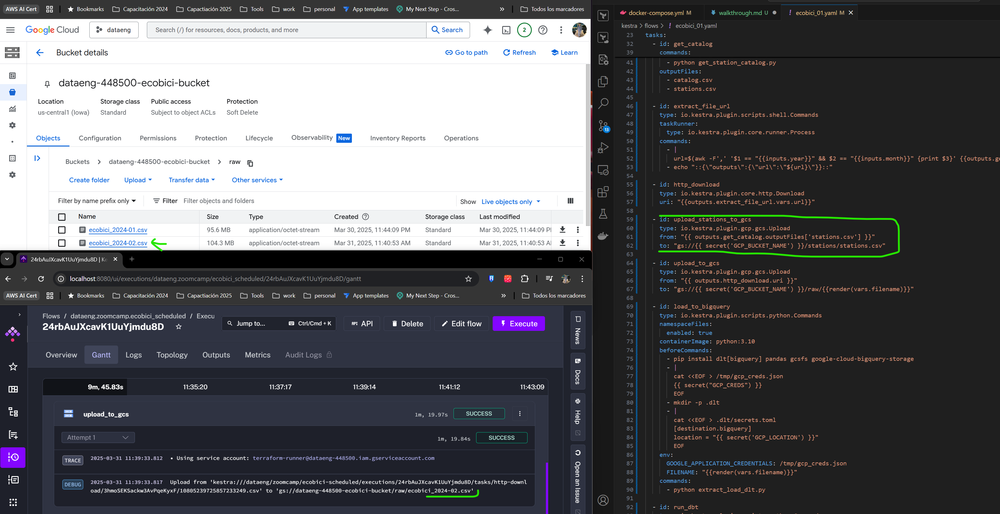
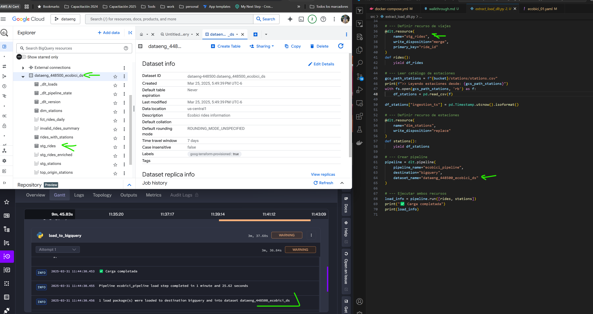
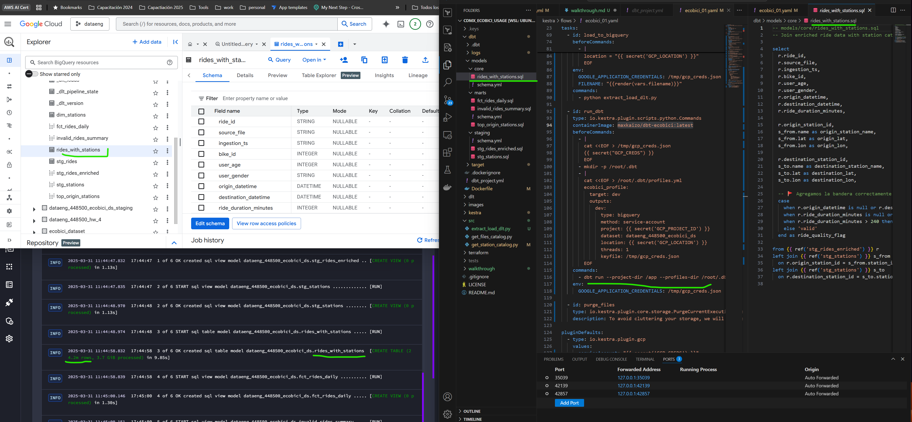
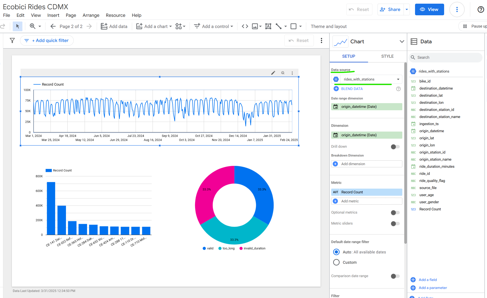

# 🚴 Ecobici Data Engineering Project - Walkthrough
This project is part of the Data Engineering Zoomcamp. It runs a batch pipeline that extracts historical trip data from Ecobici CDMX, stores it in a Data Lake, loads it into a Data Warehouse, transforms it, and finally visualizes it through dashboards.

This is an overview of the arquitechture

Let’s walk through what happens step by step:

## ☁️ First: We create the cloud resources

We use Terraform to provision our infrastructure in Google Cloud Platform (GCP).

This includes:

A GCS Bucket to store raw .csv and .json files (our Data Lake).

A BigQuery Dataset to load and transform the data (our Data Warehouse).

## We orchestrate everything in Kestra

## 🐍 Then: We download the historical data
A Python script scrapes all the available historical data links from the Ecobici website.

It downloads the CSV and JSON files locally.

This script is executed inside a Docker container to ensure consistency across environments.

## 📤 Next: We upload the files to the Data Lake

A Kestra flow uploads the downloaded files from local storage to GCS using the gcp plugin.

## 🧪 After that: We use DLT to extract and load data into BigQuery
We use DLT (Data Load Tool) to automate the ingestion process.

It extracts the raw files stored in GCS and loads them into tables in BigQuery.

DLT handles schema inference and data type mapping automatically.

This process is executed in a Docker container for consistency and easy deployment.

## 🛠️ Then: We use DBT to transform the data
With the data already in BigQuery, we use DBT (Data Build Tool) to clean and organize it.

The transformations are split into layers:

- staging: cast data types, clean column names, create datetime fields

- core: join with the station catalog and calculate metrics

- marts: aggregated tables for dashboard use

DBT models are written in SQL and executed inside a Docker container as well.

## 📊 Finally: We visualize the data
We connect Looker Studio to BigQuery to create dashboards.

These dashboards show metrics such as:

Number of trips per day/hour

Most popular stations

Trip durations and patterns over time

